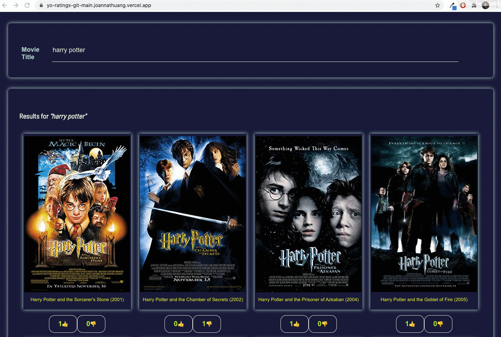

# YearOne Movie Ratings

YO-Ratings is a single page application to rate movies\
[Deployed Site Link](https://yo-ratings-git-main.joannathuang.vercel.app/)

## Getting Started

1. Fork and clone this repo
2. npm install
3. npm start
4. Visit http://localhost:3000

## Application Walk Through

### Users can search by movie name, results are displayed in chronological order by release year:

### Users can click on the movie poster to view more details:

### Users can upvote or downvote the movie:

### Vote record will persist after page refresh:

### Vote will persist through renewed search:

Created by [Joanna Huang](https://github.com/jthnyc)
